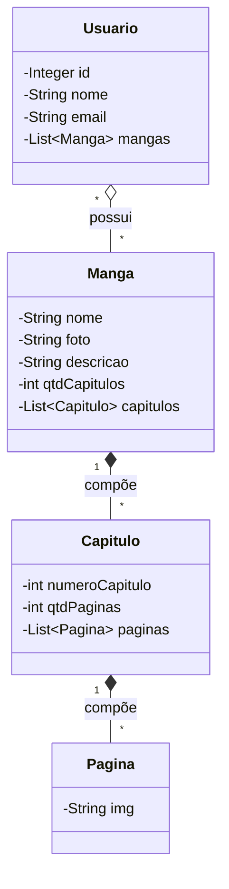

# Documentação

## Sobre

Projeto feito com a intenção de passar pelo desafio da DIO, a Digital Innovation One, a qual é uma plataforma brasileira de educação online e open education com foco em tecnologia.

## Proposta

Simular um visualizador de mangas para um usuário.

## Diagrama de classe do projeto

